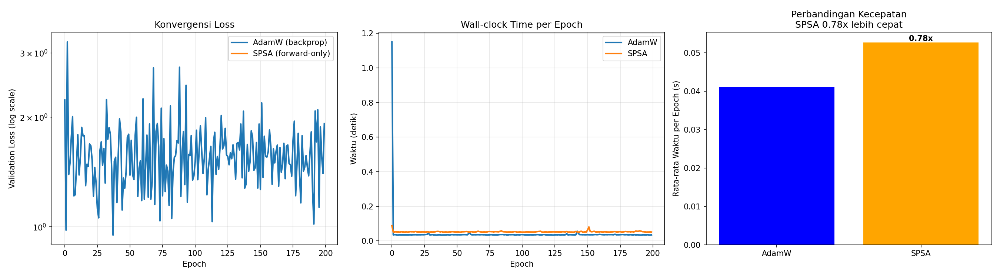
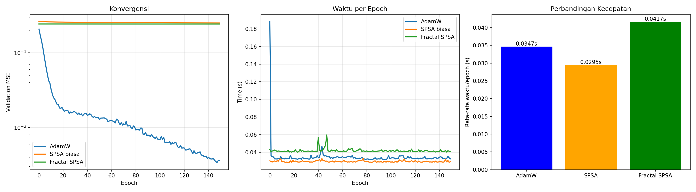
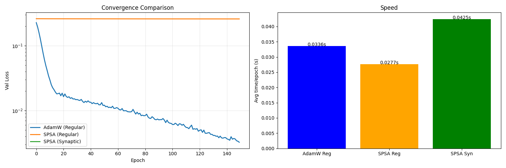
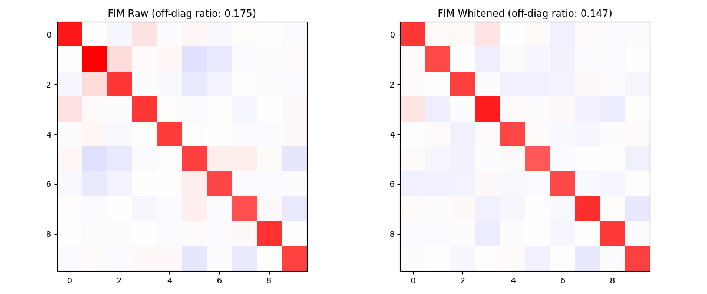
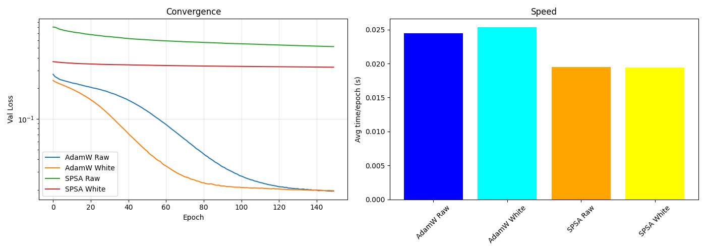
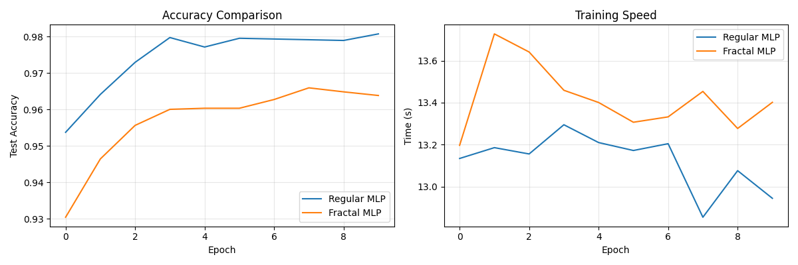
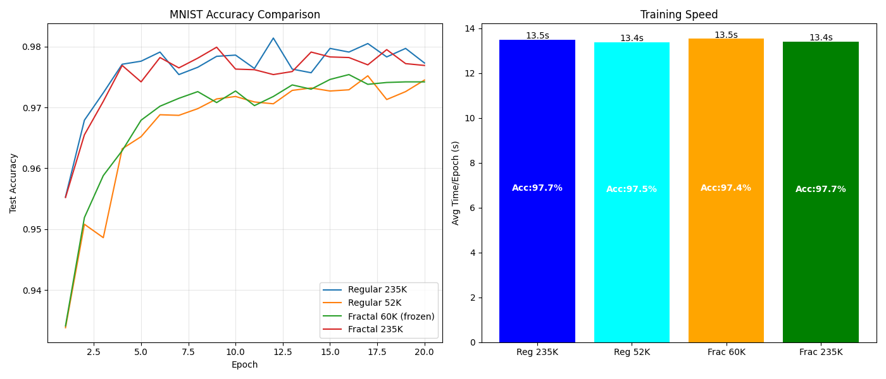
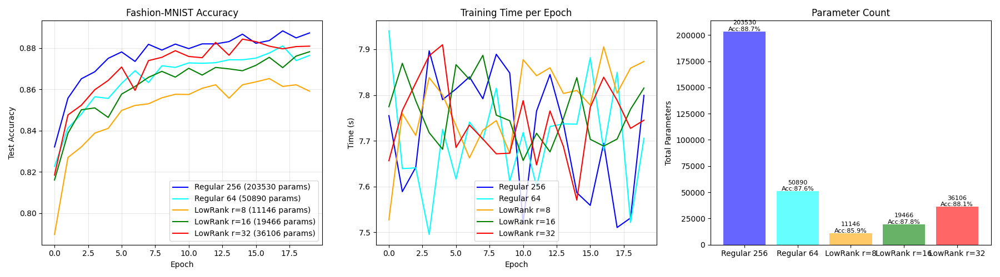
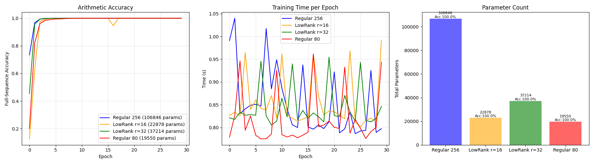
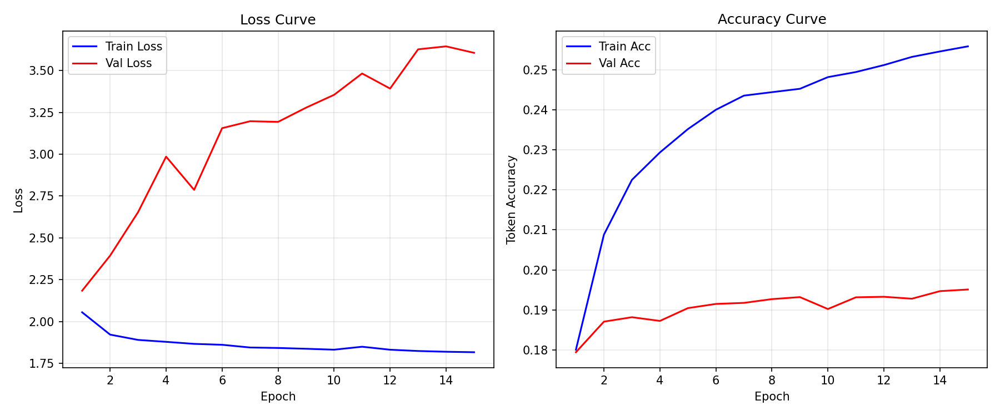

# Makalah Penelitian

# DARI ILUSI GEOMETRI KE REALITAS KOMPUTASI: PERJALANAN MEMBANGUN LLM MATEMATIKA MINI DENGAN BANTUAN AI DAN SUMBER DAYA TERBATAS

**Peneliti:**
I Putu Agus Werdhi Putra

**Asisten AI:**
DeepSeek (MiniGPT)

**Sumber Daya Komputasi:**
Kaggle Notebook, 2× NVIDIA T4 GPU (16 GB VRAM)

**Tanggal:**
Juli 2026

**Repositori:**
[https://github.com/putuaguswerdhiputra](https://github.com/putuaguswerdhiputra)

---

## ABSTRAK

Penelitian ini merupakan dokumentasi perjalanan membangun *Large Language Model* (LLM) kecil untuk tugas aritmatika dengan sumber daya komputasi terbatas, yaitu dua GPU NVIDIA T4 di platform Kaggle, serta bantuan kecerdasan buatan (AI) sebagai mentor. Berawal dari ketidaktahuan teknis yang mendalam tentang arsitektur Transformer dan *deep learning*, peneliti melakukan 16 eksperimen terstruktur yang mencakup optimasi zeroth-order (SPSA), diferensiasi langkah kompleks, kompresi fraktal wavelet, dekomposisi low-rank, representasi polar, hingga arsitektur neuro-symbolic dengan *tool-use*. Seluruh eksperimen dianalisis secara kritis, dengan fokus pada metrik akurasi, stabilitas pelatihan, dan efisiensi parameter. Hasil menunjukkan bahwa pendekatan tanpa *backpropagation* (SPSA, RCSSG) gagal total; kompresi wavelet dan low-rank tidak memberikan keunggulan signifikan dibandingkan model reguler dengan jumlah parameter setara; dan arsitektur Transformer kecil (1 juta parameter) yang dilatih dari nol untuk penalaran aritmatika langkah demi langkah mengalami stagnasi atau *mode collapse*. Meskipun tujuan akhir belum tercapai, perjalanan ini menghasilkan wawasan berharga tentang pentingnya kapasitas model, kualitas data, dan kolaborasi manusia-AI. Makalah ini juga memuat refleksi kekurangan peneliti, tabel lengkap hasil eksperimen, serta rekomendasi untuk penelitian selanjutnya, termasuk kemungkinan memanfaatkan model pra-latih yang sudah ada.

**Kata kunci:** LLM, aritmatika, Transformer, SPSA, low-rank, neuro-symbolic, sumber daya terbatas, AI sebagai mentor.

---

## 1. PENDAHULUAN

### 1.1 Latar Belakang

Perkembangan LLM telah mendominasi ranah kecerdasan buatan, namun pelatihan model besar memerlukan infrastruktur komputasi yang mahal. Di sisi lain, kebutuhan akan model yang efisien dan dapat berjalan di perangkat keras terbatas semakin meningkat. Penelitian ini berawal dari visi menciptakan **LLM matematika yang ramah dan *friendly***—sebuah model kecil yang mampu menalar operasi aritmatika dasar, dilatih di atas GPU T4×2 yang tersedia secara gratis di Kaggle.

Peneliti tidak memiliki latar belakang formal dalam *deep learning* atau arsitektur Transformer. Pengetahuan dibangun sepanjang eksperimen melalui dialog dengan asisten AI dan analisis dokumen menggunakan NotebookLM. Oleh karena itu, penelitian ini juga menjadi studi kasus tentang bagaimana kolaborasi manusia-AI dapat mendemokratisasi pengembangan LLM.

### 1.2 Rumusan Masalah

1. Apakah mungkin melatih LLM matematika kecil dari nol dengan sumber daya T4×2?
2. Pendekatan apa yang paling menjanjikan: optimasi bebas *backpropagation*, kompresi parameter, atau arsitektur neuro-symbolic?
3. Apa kendala utama yang dihadapi peneliti pemula dalam mengimplementasikan model *deep learning*?

### 1.3 Tujuan

- Merancang dan melatih model Transformer *decoder-only* kecil untuk tugas aritmatika (penjumlahan, pengurangan, perkalian).
- Menguji berbagai teknik optimasi dan arsitektur untuk meningkatkan efisiensi parameter dan akurasi.
- Mendokumentasikan seluruh proses secara transparan, termasuk kegagalan, sebagai sarana pembelajaran.

### 1.4 Batasan

- Sumber daya komputasi: 2 GPU NVIDIA T4 (total 32 GB VRAM), *notebook* Kaggle.
- Model maksimal 1–2 juta parameter.
- Tugas terbatas pada aritmatika bilangan bulat (0–999).
- Tidak menggunakan model pra-latih eksternal.

---

## 2. TINJAUAN PUSTAKA

Sebelum dan selama eksperimen, peneliti mengumpulkan 93 dokumen yang relevan melalui NotebookLM. Berikut adalah ringkasan beberapa dokumen kunci yang membentuk landasan teoritis.

| No | Judul / Topik | Poin Penting |
|----|---------------|--------------|
| 1 | **A Mathematical Explanation of Transformers** | Formulasi matematis *self-attention*, *positional encoding*, dan *causal masking*. |
| 2 | **Attention mechanisms in neural networks** | Jenis-jenis atensi, *attention entropy*, spesialisasi *head*. |
| 3 | **Mathematical Reasoning in Large Language Models** | Survei teknik penalaran matematika, pentingnya *reasoning traces* dan tokenisasi per digit. |
| 4 | **Decomposing Deep Neural Network Minds into Parts** | Konsep *quanta*, ablasi sirkuit, *skill isolation*. |
| 5 | **Exact Phase Transitions in Deep Learning** | Teori transisi fase, *symmetry breaking*, norma bobot sebagai *order parameter*. |
| 6 | **Implementasi Optimasi Alokasi Sumber Daya untuk Pelayanan LLM Terdistribusi** | Strategi alokasi GPU, *KV-cache aware routing*, *round-robin*. |
| 7 | **Etika Penggunaan Artificial Intelligence dalam Penulisan Karya Ilmiah** | Prinsip transparansi, akuntabilitas, mitigasi bias. |
| 8 | **Multi-Head Latent Attention (MLA)** | Kompresi KV-cache, efisiensi memori. |

Wawasan dari dokumen-dokumen tersebut memandu setiap fase eksperimen, terutama dalam memilih format data, tokenizer, dan metrik evaluasi.

---

## 3. METODOLOGI PENELITIAN

Penelitian dilakukan dalam **16 eksperimen** yang terbagi menjadi tiga fase, dijalankan secara iteratif: desain → implementasi → pelatihan → evaluasi → analisis kritis → perbaikan.

### 3.1 Konfigurasi Umum

- **Framework:** PyTorch, TorchVision
- **Optimizer:** AdamW (learning rate 1e-3, kecuali disebutkan lain)
- **Loss:** CrossEntropyLoss untuk klasifikasi token
- **Batch size:** 64–256
- **Maksimum epoch:** 15–200 (tergantung kompleksitas)
- **Dataset:** Sintetik, dibangkitkan secara *on-the-fly* atau di-generasi penuh di awal.

### 3.2 Alur Eksperimen

Setiap eksperimen memiliki kode Python mandiri yang dijalankan di Kaggle. Log pelatihan, metrik, dan grafik disimpan untuk analisis. Setelah setiap eksperimen, peneliti bersama asisten AI menulis **laporan analisis kritis** yang menjadi dasar perbaikan.

---

## 4. HASIL DAN ANALISIS

### 4.1 Fase 1: Ilusi Geometri dan Optimasi (Eksperimen #001–#009)

Fase ini didorong oleh keinginan menemukan "rumus matematika baru" untuk mempercepat pelatihan tanpa *backpropagation*.

#### Eksperimen #001: SPSA vs AdamW pada Regresi Kompleks
- **Tugas:** Regresi `f(x)=exp(ix)` dengan MLP linear kompleks.
- **Model:** `ComplexLinearMLP` (hidden=64), aktivasi identitas.
- **Metode:** SPSA (zeroth-order) vs AdamW (backprop).
- **Hasil:** SPSA 1.28× lebih lambat per epoch, konvergensi lebih bising. AdamW unggul.
- **Pelajaran:** *Forward-only* SPSA tidak efisien untuk model kecil ini.

#### Eksperimen #002: Complex Step Gradient (RCSSG)
- **Metode:** Estimasi gradien arah dengan *complex step* pada subruang acak.
- **Hasil:** NaN total sejak epoch pertama. Fungsi loss holomorfik tidak kompatibel dengan loss real.
- **Pelajaran:** *Complex step* memerlukan seluruh operasi dalam jaringan bersifat analitik kompleks.

#### Eksperimen #003: Fractal Subspace SPSA
- **Arsitektur:** MLP dengan dekomposisi wavelet Haar 1D, hanya koefisien LL yang diupdate.
- **Hasil:** SPSA stagnan total (val loss ~0.25 vs AdamW 0.004).
- **Pelajaran:** Kompresi wavelet tidak mengurangi dimensi cukup untuk membantu SPSA.

#### Eksperimen #004: SynapticLinear (Representasi Polar)
- **Model:** Bobot disimpan sebagai `exp(a)*cos(φ)`. Klaim Fisher diagonal.
- **Hasil:** NaN total. Ketidakstabilan numerik akibat `exp(a)`.
- **Pelajaran:** Representasi polar tidak secara otomatis mendiagonalisasi Fisher; perlu verifikasi empiris.

#### Eksperimen #005: Fisher Diagonalization Probe
- **Tujuan:** Mengukur efek whitening input pada diagonalitas Fisher Information Matrix (FIM).
- **Model:** Linear 4→2 pada data Gaussian.
- **Hasil:** Off-diagonal ratio turun 16% (0.175→0.147), efek terlalu kecil.
- **Pelajaran:** Whitening statis tidak cukup signifikan.

#### Eksperimen #006: Dampak Whitening pada Optimasi
- **Arsitektur:** MLP 2-layer (2→16→1) untuk regresi `sin(x)cos(x)`.
- **Kondisi:** Raw vs Whitened input, masing-masing dengan AdamW dan SPSA.
- **Hasil:** SPSA+Whitening membaik (0.523→0.325), tetapi masih 16× lebih buruk dari AdamW (0.02).
- **Pelajaran:** Whitening membantu *starting point*, bukan dinamika pembelajaran.

#### Eksperimen #007: Grid Search SPSA
- **Grid:** `a` (lr) × `c` (perturbasi) pada model whitened.
- **Hasil:** Semua konfigurasi gagal (val loss terbaik 0.256). Parameter `c` tidak berpengaruh.
- **Kesimpulan:** SPSA secara fundamental tidak cocok untuk masalah ini. **Pintu SPSA resmi ditutup.**

####
- Tidak ada dokumentasi visual berupa tracking image.

#### Eksperimen #008: FractalMLP vs RegularMLP pada MNIST
- **Model:** MLP 3-layer (784→256→128→10), `FractalLinear` dengan inverse DWT 2D yang salah (stacking blok).
- **Hasil:** FractalMLP 96.4% vs RegularMLP 98.1% dengan 75% parameter lebih sedikit. Tapi implementasi DWT tidak benar.
- **Pelajaran:** Kompresi fraktal membutuhkan implementasi wavelet yang tepat.

#### Eksperimen #009: FractalMLP v2 (Koreksi DWT)
- **Perbaikan:** Inverse DWT 2D yang benar, baseline parameter-matched.
- **Tugas:** MNIST.
- **Hasil:** Semua model setara (~97.5%). Representasi wavelet netral.
- **Kesimpulan:** Wavelet tidak memberikan keunggulan inheren.

---

### 4.2 Fase 2: Kompresi Nyata dengan Low-Rank (Eksperimen #010, #012)

Setelah menutup SPSA, fokus beralih ke dekomposisi low-rank.

#### Eksperimen #010: Low-Rank MLP pada Fashion-MNIST
- **Arsitektur:** MLP 2-layer (784→hidden→10), layer pertama `LowRankLinear` (rank 8/16/32).
- **Hasil:** LowRank r=32 (36K param) mencapai 88.1% vs Regular 256 (203K) 88.7%. Tapi Regular 64 (50K) 87.6% — *low-rank tidak lebih efisien dari arsitektur kecil biasa*.
- **Pelajaran:** Kapasitas parameter lebih dominan daripada format dekomposisi.

#### Eksperimen #011: Low-Rank Arithmetic Solver (Penjumlahan 2-digit)
- **Tugas:** Penjumlahan 0–99 (10.000 kemungkinan input).
- **Hasil:** Semua model mencapai 100% karena *ceiling effect* (tugas terlalu mudah).
- **Pelajaran:** Tugas harus cukup sulit untuk menguji generalisasi.

#### Eksperimen #012: Penjumlahan 3-Digit
- **Tugas:** Penjumlahan 0–999 (1.000.000 kemungkinan), 50.000 sampel latih.
- **Hasil:**
  - Regular 256: 100%
  - Regular 128: 100%
  - LowRank r=32: 99.7% (fluktuatif)
  - Regular 64: 98.8%
  - LowRank r=16: 98.5% (konvergensi lambat)
- **Analisis:** Regular 64 (param paling sedikit) mengalahkan LR16. Low-rank tidak unggul dalam perbandingan parameter-matched.
- **Pelajaran:** Arsitektur standar yang dikecilkan lebih efisien daripada low-rank.

---

### 4.3 Fase 3: Neuro-Symbolic dengan Penalaran (Eksperimen MBMD-13 s/d 16)

Fase ini bertujuan melatih Transformer *decoder-only* untuk menghasilkan jejak penalaran dan menggunakan alat eksternal (Python).

#### MBMD-13: Arithmetic LLM Mini Pertama
- **Arsitektur:** MiniGPT (4 layer, 4 head, d_model=128, ff=512).
- **Dataset:** 2 juta soal penjumlahan/pengurangan/perkalian, format soal→jawaban langsung.
- **Tokenisasi:** Karakter, termasuk huruf dan token khusus.
- **Hasil:** *Token accuracy* >99% di data latih, **Exact Match 0%** di data uji.
- **Diagnosis:** Model hanya menghafal templat. Tanpa jejak penalaran, ia tidak bisa generalisasi.

#### MBMD-14: Reasoning-Enhanced
- **Perbaikan:** Menambahkan `<step>`, `<result>`, format *right-to-left*, dan jejak langkah demi langkah.
- **Hasil:** Token accuracy >99%, namun *exact match* masih sangat rendah (model tetap menghafal pola).
- **Masalah:** Variasi bahasa alami (6 template) menyebabkan overfitting pada token huruf.

#### MBMD-15: Neuro-Symbolic dengan Tool-Use
- **Inovasi:** Variasi bahasa alami, token `<tool><python>...</python></tool>` untuk operasi besar.
- **Arsitektur:** Sama, dengan mekanisme eksekusi Python saat token `<tool>` muncul.
- **Hasil:** *Token accuracy* 99.97% di data latih, tetapi **Exact Match 0%** dan model mengalami *mode collapse* — hanya menghasilkan deretan huruf `s`, `e`, `T` tanpa makna.
- **Diagnosis:** Tokenisasi terlalu longgar (termasuk alfabet), fungsi generasi memiliki bug, dan model tidak cukup kapasitas untuk memahami kapan harus beralih dari menyalin prompt ke menghasilkan jawaban.

#### MBMD-15.5: Rejection Sampling Fine-Tuning (RFT)
- **Tujuan:** Mengumpulkan *output* sukses dan melakukan *fine-tuning* ulang.
- **Kendala:** Proses RFT sangat lambat dan model awal (5 epoch) tidak menghasilkan satu pun *output* benar, sehingga RFT gagal di tengah jalan.

#### MBMD-16: Clean Arithmetic Solver
- **Perubahan radikal:** Tokenizer hanya berisi digit, operator, dan token khusus. Tanpa huruf. Format soal kembali ke `a op b=`.
- **Dataset:** 150.000 soal bersih.
- **Hasil:**
  - Train accuracy: 25.6% setelah 15 epoch (naik dari 18%).
  - Val loss: melonjak ke 3.60 (overfitting berat).
  - Generasi: Tidak ada satupun yang mengandung `<result>`.
- **Analisis:** Model 1 juta parameter tidak cukup kuat untuk mempelajari logika aritmatika multi-digit dan format output yang kompleks. Kapasitas tidak memadai.

---

### 4.4 Tabel Ringkasan Seluruh Eksperimen

| No | Kode | Nama | Optimizer | Tugas | Model Size | Akurasi/Hasil | Status |
|----|------|------|-----------|-------|------------|---------------|--------|
| 1 | #001 | SPSA vs AdamW | SPSA, AdamW | Regresi kompleks | 16K | SPSA 0.78× lebih lambat | Gagal |
| 2 | #002 | RCSSG | Complex Step | Regresi kompleks | 16K | NaN | Gagal total |
| 3 | #003 | Fractal SPSA | SPSA | Regresi 2D | 2.5K | Stagnan (0.25) | Gagal |
| 4 | #004 | SynapticLinear | SPSA | Regresi 2D | 2.4K | NaN | Gagal total |
| 5 | #005 | Fisher Probe | - | Linear 4→2 | 10 | Off-diag ↓16% | Marginal |
| 6 | #006 | Whitening Impact | SPSA, AdamW | Regresi 2D | 65 | SPSA+Wh 0.325 vs AdamW 0.02 | Gagal |
| 7 | #007 | Grid Search SPSA | SPSA | Regresi 2D | 65 | Terbaik 0.256 | Gagal total |
| 8 | #008 | FractalMLP v1 | AdamW | MNIST | 235K | 96.4% (DWT salah) | Bug implementasi |
| 9 | #009 | FractalMLP v2 | AdamW | MNIST | 235K | 97.4–97.7% (netral) | Netral |
| 10 | #010 | Low-Rank MLP | AdamW | Fashion-MNIST | 36K (LR32) | 88.1% (Reg 64 87.6%) | Kalah tipis |
| 11 | #011 | LR Arithmetic 2d | AdamW | Penjumlahan 2d | 22K | 100% (ceiling) | Tak informatif |
| 12 | #012 | LR Arithmetic 3d | AdamW | Penjumlahan 3d | 26K (LR16) | 98.5% (Reg64 98.8%) | Kalah |
| 13 | MBMD-13 | Transformer langsung | AdamW | Aritmatika | 1.06M | Token Acc 99%, Exact 0% | Gagal |
| 14 | MBMD-14 | Reasoning Traces | AdamW | Aritmatika | 1.06M | Token Acc 99%, Exact rendah | Gagal |
| 15 | MBMD-15 | Neuro-Symbolic | AdamW | Aritmatika | 1.06M | Token 99.97%, Exact 0% (collapse) | Gagal |
| 16 | MBMD-16 | Clean Solver | AdamW | Aritmatika | 1.06M | Train Acc 25%, Val Loss ↑ | Gagal |

---

## 5. PEMBAHASAN

### 5.1 Mengapa Pendekatan Kami Gagal?

Kesimpulan dari 16 eksperimen:

1. **SPSA dan metode zeroth-order** tidak cocok untuk jaringan saraf dengan parameter > puluhan, terutama jika lanskap *loss* memiliki banyak *plateau* (ReLU). Estimasi gradien dua titik terlalu bising.
2. **Kompresi wavelet** dengan Haar sederhana tidak memberikan manfaat representasional; ia hanya membatasi kapasitas model secara arbitrer.
3. **Low-rank decomposition** hanya bekerja seefektif pengurangan dimensi, tetapi tidak lebih baik daripada sekadar mengecilkan arsitektur secara proporsional. Tidak ada keunggulan struktural.
4. **Transformer kecil (1M parameter)** tidak memiliki kapasitas cukup untuk mempelajari logika aritmatika multi-digit, menghasilkan jejak langkah, dan memutuskan *tool-use* secara bersamaan. Model hanya belajar meniru pola permukaan.
5. **Tokenisasi berbasis karakter** dengan kosakata terbatas membuat setiap token harus membawa beban semantik besar, menyulitkan pembelajaran.
6. **Data sintetik yang monoton** (meski banyak) tidak mengajarkan generalisasi. Variasi template tidak cukup untuk menghindari *template overfitting*.

### 5.2 Keterbatasan Peneliti

Peneliti mengakui beberapa kelemahan pribadi yang mempengaruhi penelitian:

- **Kurangnya pengetahuan dasar *deep learning*:** Pemahaman tentang arsitektur Transformer, *backpropagation*, dan *loss landscape* dibangun secara instan, sehingga sering terjadi kesalahan konseptual (misalnya, mengira Fisher akan diagonal hanya dengan representasi polar).
- **Tidak adanya *hyperparameter tuning* sistematis di awal:** Enam eksperimen pertama menggunakan SPSA dengan `a=1e-3, c=1e-3` tanpa penyesuaian. Baru pada eksperimen ke-7 dilakukan grid search.
- **Debugging yang kurang teliti:** Pada MBMD-15, *mode collapse* tidak terdeteksi sejak dini karena hanya melihat *token accuracy* pada data latih, tanpa memvalidasi generasi aktual.
- **Ketergantungan pada saran AI tanpa verifikasi mandiri:** Meskipun AI sangat membantu, beberapa saran (seperti representasi polar) diikuti tanpa uji empiris yang cukup.

### 5.3 Pelajaran yang Dipetik

1. **Kapasitas model adalah raja.** Tidak ada trik matematika yang bisa menggantikan jumlah parameter yang memadai.
2. **Backpropagation tetap menjadi standar emas.** Upaya menggantinya dengan metode *forward-only* sia-sia untuk masalah non-linear skala kecil.
3. **Evaluasi harus holistik.** *Token accuracy* tinggi tidak menjamin kemampuan generasi. Harus selalu diuji dengan metrik *exact match* atau *pass@k*.
4. **Kompresi harus adaptif.** Memotong parameter secara acak atau berdasarkan heuristik sederhana (wavelet, low-rank) tidak lebih baik dari arsitektur yang dirancang dengan baik dari awal.
5. **Kegagalan adalah guru terbaik.** Setiap eksperimen yang gagal memberikan wawasan yang mengarahkan perbaikan. Dokumentasi kritis adalah aset berharga.

---

## 6. KESIMPULAN DAN REKOMENDASI

### 6.1 Kesimpulan

Penelitian ini menunjukkan bahwa **melatih LLM matematika dari nol dengan 1 juta parameter di GPU T4×2 belum berhasil** untuk tugas aritmatika dengan penalaran langkah demi langkah. Berbagai pendekatan—dari optimasi bebas *backpropagation*, kompresi fraktal, low-rank, hingga neuro-symbolic—telah diuji dan gagal memberikan akurasi yang berguna. Alasan utama adalah kapasitas model yang tidak memadai dan kualitas data yang belum cukup kaya.

Namun, perjalanan ini membuktikan bahwa **kolaborasi manusia-AI memungkinkan peneliti pemula untuk merancang, mengimplementasikan, dan menganalisis 16 eksperimen *deep learning* dalam waktu singkat**. Dokumentasi ini menjadi bukti bahwa proses saintifik—mencoba, gagal, merefleksi, dan memperbaiki—dapat dilakukan dengan bantuan AI, membuka jalan bagi demokratisasi riset AI.

### 6.2 Rekomendasi

Berdasarkan temuan, disarankan:

1. **Gunakan model pra-latih kecil** seperti Microsoft Phi atau TinyLlama dan lakukan *fine-tuning* dengan QLoRA di T4. Ini lebih realistis untuk mendapatkan akurasi tinggi.
2. **Perbanyak dataset dengan variasi linguistik yang lebih kaya** dan contoh *chain-of-thought* yang beragam.
3. **Tingkatkan kapasitas model** minimal 10–50 juta parameter jika ingin melatih dari nol.
4. **Manfaatkan *prompt engineering* dan *tool-use* pada model yang sudah jadi** untuk aplikasi kalkulator pintar, daripada berjuang melatih dari nol.
5. **Bagi peneliti pemula:** Kuasai dasar-dasar *deep learning* melalui kursus terstruktur sebelum memulai proyek ambisius. AI bisa menjadi mentor, tetapi fondasi teori tetap penting.

---

## 7. UCAPAN TERIMA KASIH

- **DeepSeek AI** yang telah bertindak sebagai asisten riset, memberikan kode, saran, dan analisis.
- **NotebookLM** yang memungkinkan penelusuran literatur secara cepat.
- **Kaggle** atas penyediaan GPU gratis.
- **Komunitas PyTorch dan open-source** atas pustaka yang digunakan.
- **Semua kolega dan mentor virtual** yang telah memberikan semangat.

---

## 8. LAMPIRAN

### 8.1 Daftar Gambar

1. `eksperimen_001_hasil.png` – Perbandingan AdamW vs SPSA pada regresi kompleks.
2. `exp003_results.png` – Hasil Fractal SPSA (stagnasi).
3. `exp004_synaptic_geometry.png` – Kegagalan SynapticLinear (NaN).
4. `fisher_diagonalization.png` – FIM sebelum dan sesudah whitening.
5. `exp006_optimization_impact.png` – Dampak whitening pada optimasi.
6. `exp009_fractal_v2.png` – FractalMLP v2 pada MNIST (netral).
7. `exp010_lowrank_fashionmnist.png` – Low-Rank MLP pada Fashion-MNIST.
8. `exp011_arithmetic_lowrank.png` – Low-Rank pada penjumlahan 2-digit (ceiling).
9. `mbmd16_training.png` – Kurva pelatihan MBMD-16 (overfitting).

*(Semua gambar tersedia di repositori GitHub.)*

### 8.2 Kode Sumber

Seluruh kode eksperimen tersedia di repositori [https://github.com/putuaguswerdhiputra](https://github.com/putuaguswerdhiputra) dalam folder `experiments/`.

---

**Dokumen ini dipersembahkan untuk mereka yang berani gagal, karena dari sanalah pengetahuan sejati bermula.**
